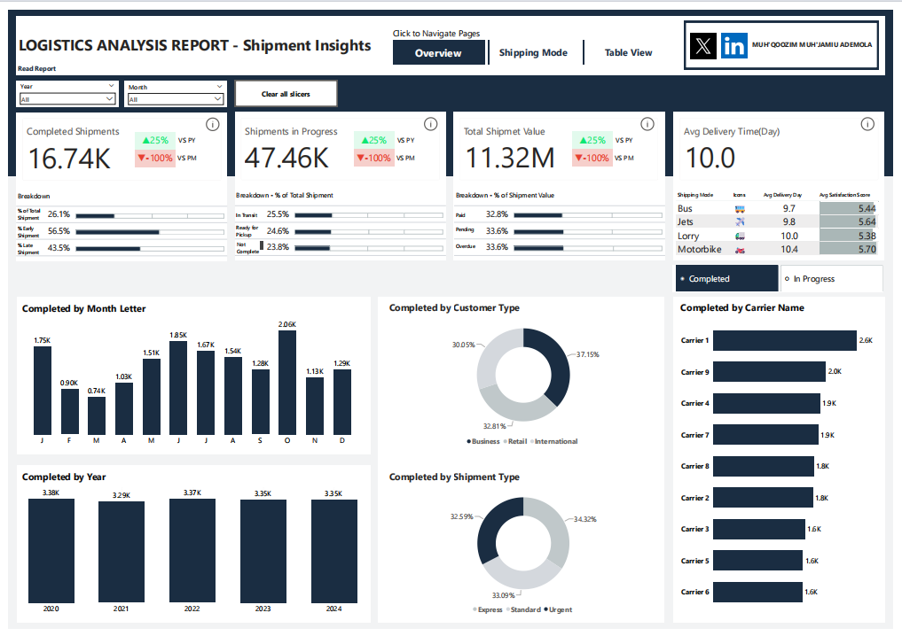
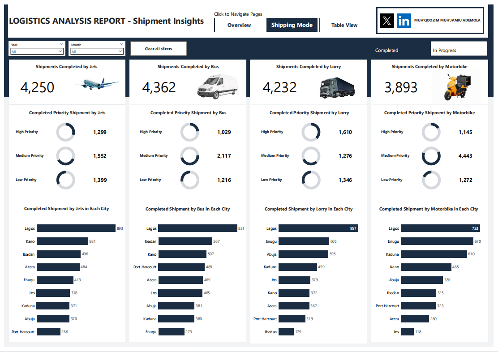
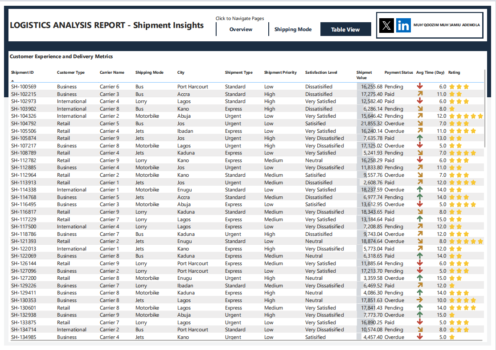

# Logistics Network Performance Analysis

## Table of Contents
- Overview
- Key Metrics Snapshot
- Problem Statement
- Objectives
- Dataset
- Data Preparation
- Methodology
- Key Insights
- Recommendations
- Full Analysis
- Dashboard Preview
- Business Impact
- Conclusion
- Key Learnings
- Author

---

## Overview
This project analyzes **64,201 logistics shipments (2020–2024)** across Nigeria and Ghana to evaluate delivery performance and uncover operational inefficiencies.

Despite operating at scale, the analysis reveals a system that has **failed to improve over time**, with persistent delivery failures, inefficient routing decisions, and growing financial risk.

---

## Key Metrics Snapshot

- **Total Shipments:** 64,201  
- **Completion Rate:** 26.1%  
- **Non-Completion Rate:** 73.9%  
- **Highest Late Rate:** Jets (50.3%)  
- **Highest Failure Rate:** Motorbike (26.6%)  
- **Time Period:** 2020 – 2024  

---

## Problem Statement
The logistics network operates consistently but inefficiently, showing **no measurable improvement in performance over five years**.

Key issues include:
- High shipment failure and delay rates  
- Poor alignment between shipping mode and delivery requirements  
- Inefficient routing across cities  
- High overdue payments linked to delivery performance  

---

## Objectives
- Evaluate shipment completion and failure rates  
- Analyze delivery speed across shipping modes  
- Measure delivery punctuality (early, on-time, late)  
- Assess performance across cities and routes  
- Compare carrier performance  
- Analyze customer behavior and payment patterns  
- Identify operational and financial inefficiencies  

---

## Dataset
- **Total Records:** 64,201 shipments  
- **Time Period:** 2020 – 2024  
- **Cities:** 9 (Nigeria & Ghana)  
- **Shipping Modes:** Bus, Lorry, Jets, Motorbike  
- **Carriers:** 9  

### Key Features
- Shipment Status  
- Delivery Time (Days)  
- Estimated vs Actual Delivery Date  
- Shipment Value  
- Payment Status  
- Customer Type  
- Shipment Priority  
- Shipment Type  

---
## Data Preparation
- Cleaned and transformed data using Power BI (Power Query)  
- Standardized shipment status and delivery categories  
- Created calculated columns for delivery performance analysis  
- Structured dataset for efficient reporting and visualization
---

## Methodology
- Data cleaning and transformation using Power BI and Excel  
- Time-based delivery performance analysis  
- Aggregation of key performance metrics  
- Cross-analysis:
  - Mode × City  
  - Carrier × Mode  
  - Mode × Shipment Type
  - Mode x Customer Type
  - Mode x Shipment Priority  
- Year-over-year trend analysis  
- Financial impact analysis (delivery performance vs payment outcomes)  

---

## Key Insights

### 1. Completion Crisis
- Only **26.1% of shipments were completed**
- Over **15,000 shipments failed entirely**

---

### 2. Mode Performance
- **Bus:** Most reliable and balanced  
- **Lorry:** Fastest when deliveries are completed  
- **Jets:** High speed but **chronically late (50.3%)**  
- **Motorbike:** Slowest and most unreliable  

---

### 3. Delivery vs Payment Relationship
Higher late delivery rates directly result in **higher overdue payments**, especially in premium delivery modes.

---

### 4. Routing Inefficiencies
Delivery performance varies significantly by city:
- Lorry performs best in Accra  
- Bus dominates in Jos  
- Jets performs best in Lagos  
- Motorbike is only optimal in Abuja  

No evidence of optimized routing strategy across the network.

---

### 5. Operational Plateau
Across five years:
- No improvement in delivery speed  
- No improvement in completion rates  
- No efficiency gains  

---

## Recommendations
- Implement **city-based routing strategy**  
- Restrict Motorbike usage for urgent and high-risk shipments  
- Address Jets delivery delays through scheduling improvements  
- Align shipment priority with appropriate shipping modes  
- Protect high-value shipments from unreliable delivery modes  
- Set measurable performance targets  
- Align operational decisions with financial outcomes  

---
## Full Analysis

The complete analysis, including detailed insights, methodology, and recommendations, is published on Medium:

👉 [Read Full Analysis](https://bit.ly/4swIeWf)
---

## Dashboard Preview

---
Interact with the dashboard here: https://app.powerbi.com/view?r=eyJrIjoiMWQ0ZjVjYTctNThkMi00M2Y1LTg2OTItMGNmYWI5ODNhNjAxIiwidCI6IjkxNWM3ZmVjLTk2Y2UtNDQ5Yy1iNzdiLWI4MWNiOWQ5ZDg4OSJ9
---

## Business Impact
This analysis highlights critical operational and financial risks:

- High non-completion rates indicate significant revenue loss  
- Late deliveries are driving overdue payments and affecting cash flow  
- Poor routing decisions increase delivery time and operational inefficiency  
- High-value shipments are exposed to unreliable delivery modes  

Addressing these issues can lead to:
- Improved delivery success rates  
- Reduced overdue payments  
- Better customer satisfaction  
- More efficient logistics operations  

---

## Conclusion
The logistics operation is functional but inefficient.

Performance has remained unchanged over time, with systemic issues in routing, delivery execution, and carrier utilization.

Improvement requires **data-driven decision-making and operational restructuring**, not increased scale.

---

## Key Learnings
- Data analysis is most valuable when tied to business decisions  
- Operational inefficiencies often have direct financial consequences  
- Aggregated metrics can hide critical performance gaps  
- Segmentation reveals deeper and more actionable insights  

---

## Author
**Muh’Qoozim Muh’Jamiu**  
Data Analyst | Operations & Strategy  
  
